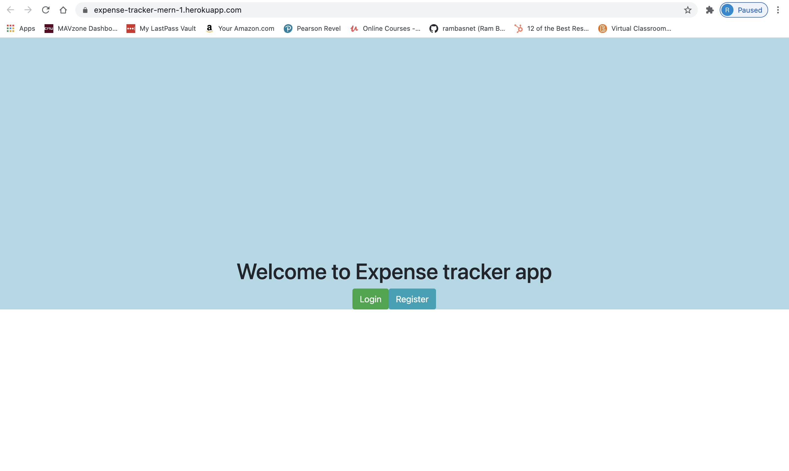
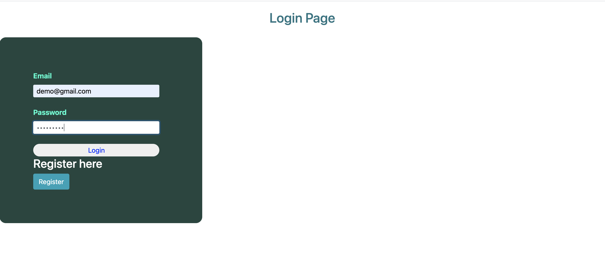
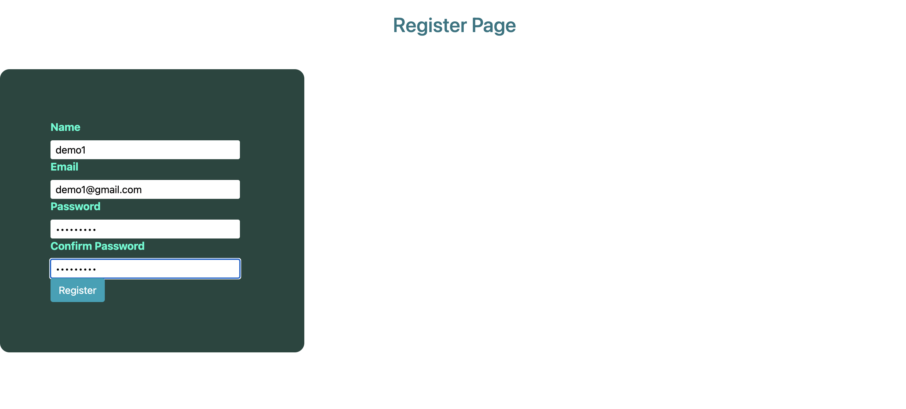
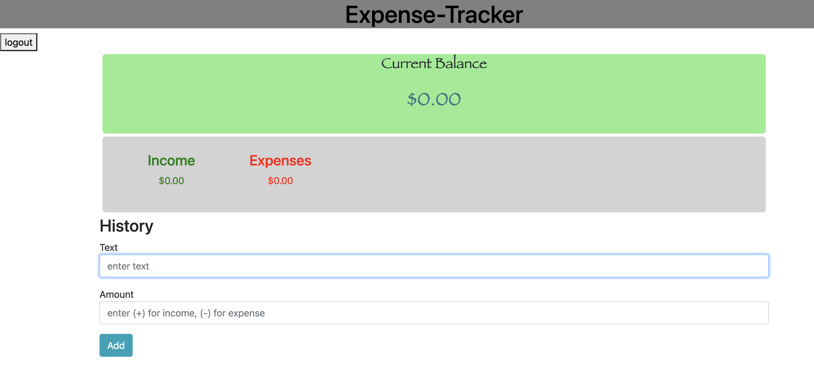
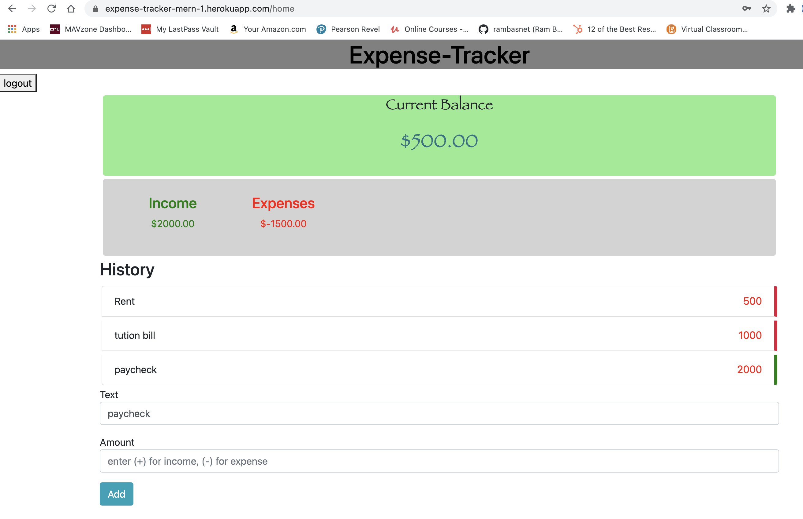

## Expense-Tracker App (MERN)

This is my first MERN app. This is a very simple app where user can input their total expenditure on different items for a month and also input their total income for a month. This app substracts expenditure from income and let you know where you stand interms of finance like whether you were at loss or you made some saving.

## Demo video : Please click the link to see how my app works
https://coloradomesa.zoom.us/rec/share/7MrZpbMIQ-ci4ZtB7g9BJaSw4auZGiZ_rrWOZWX99AGkD8vN0LfoIqI4e6vkIQWb.-Kxo6RuvEs5CaRgP

## Website link : 
https://expense-tracker-mern-1.herokuapp.com/

# Deliverables 
- Used MongoDB as backend database to store data
- Used  HTML, CSS, Javascript and bootstrap framework for user interface (web design) layout and design using React
- Provided a functionality for user signup
- Provided authentication service or a functionality for users to login
- Deployed project to Heroku via https://expense-tracker-mern-1.herokuapp.com/

# Screenshot of Functionlity
## Home page

## User login page

## User sign up / Register page

## What user can see once they are logged in

## User can add and delete income and expenses and the app will calculate current balance and User are also provided with logout button.

# Note :
 This app is very simple as it was my first MERN stack app. I will keep working on this project and will add some more functions during this summer. There are still some parts which could have been better but becuase of time restriction, I could not update them as of now. My goal is to learn more about MERN and Nextjs in future. 

